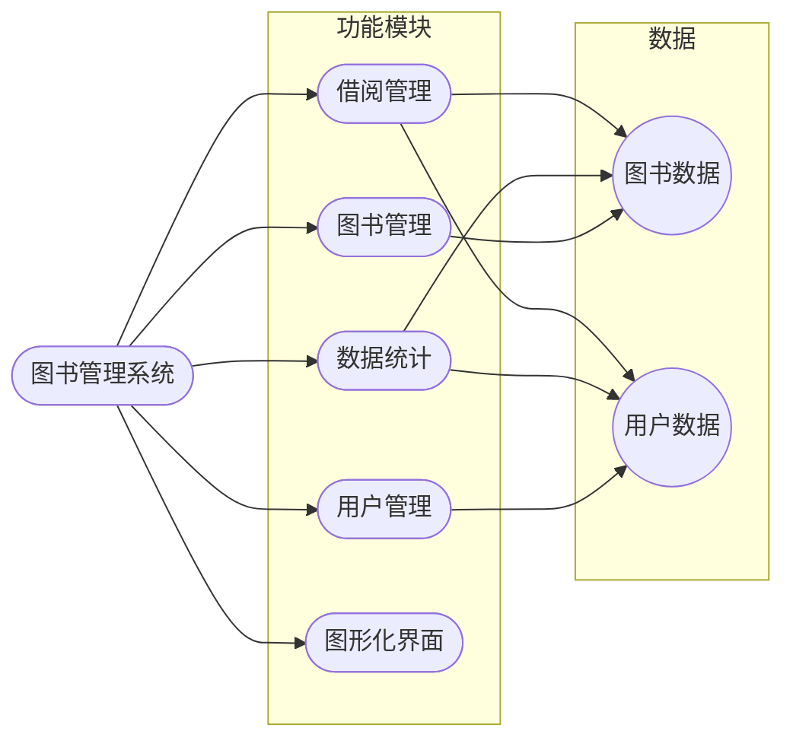
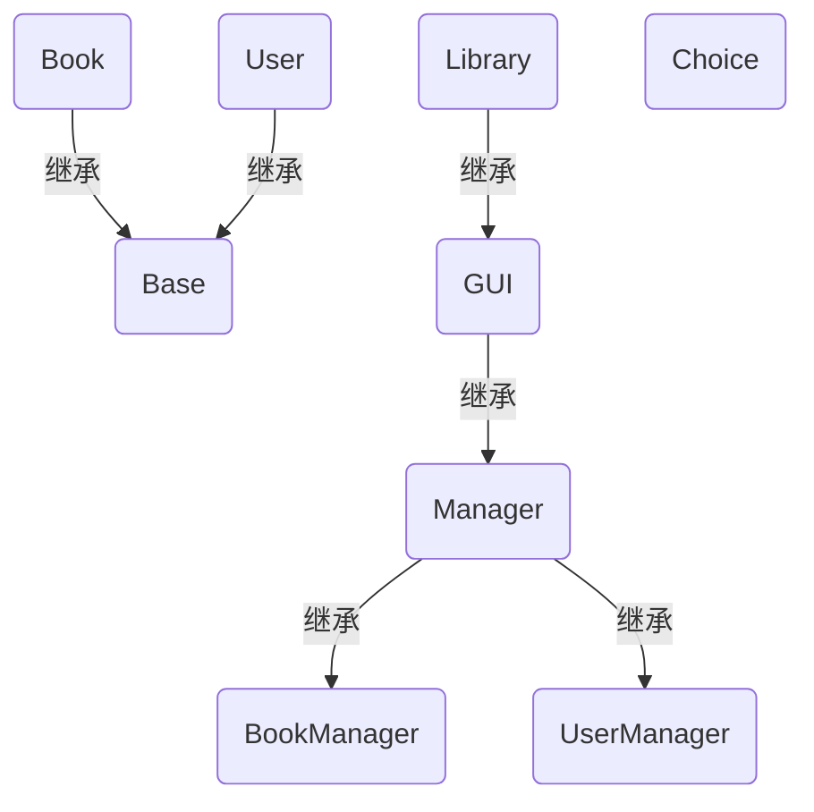
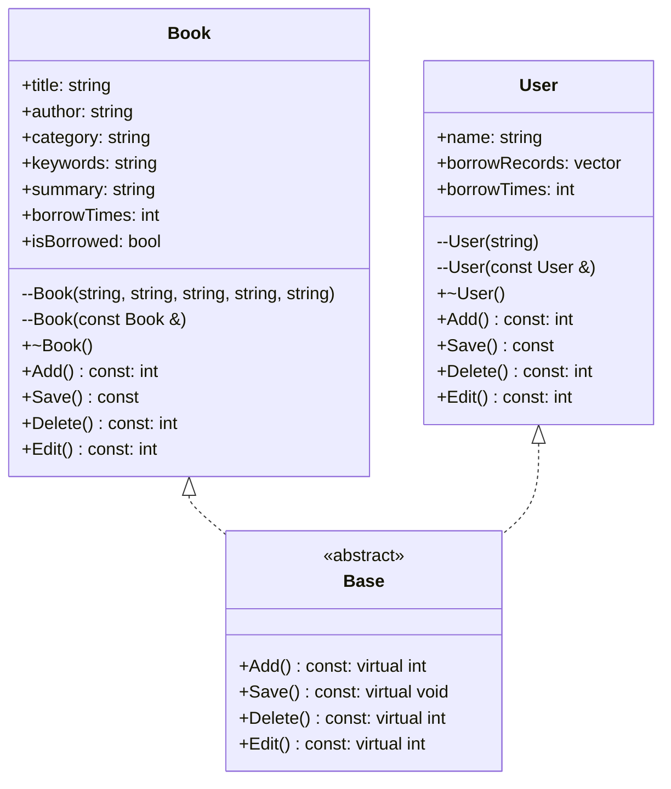
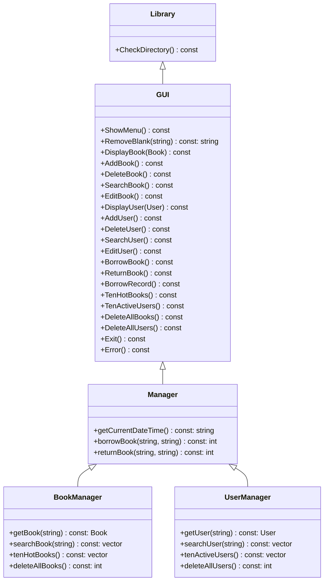
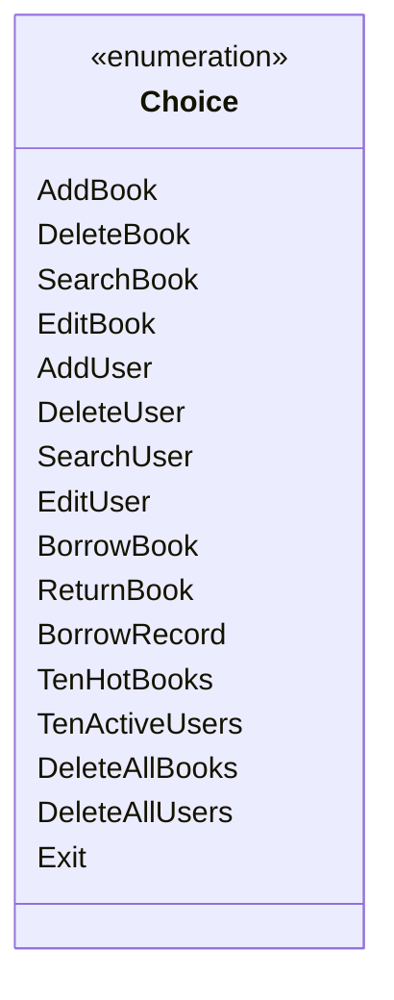

# 图书管理系统

## 系统需求分析

### 目的

- 开发一个功能完善、操作简单、界面友好的图书管理系统，实现图书和用户的增删查改、借阅、归还、记录查询、热门图书和活跃用户统计等功能，提高图书馆的管理效率和服务质量。

### 系统需求

#### 图书管理

- **新建图书**
  - 输入图书信息，包括名称、作者、分类、关键词、简介。
- **修改图书信息**
  - 输入需要修改的图书名称，显示图书信息，输入修改后的信息。
- **删除图书**
  - 输入需要删除的图书名称，确认删除。
- **模糊查询图书**
  - 输入搜索词，显示查询结果。

#### 用户管理

- **新建用户**
  - 输入用户信息，包括用户名。
- **修改用户信息**
  - 输入需要修改的用户名，输入新用户名。
- **删除用户**
  - 输入需要删除的用户名，确认删除。
- **模糊查询用户**
  - 输入搜索词，显示查询结果。

#### 借阅管理

- **图书借阅**
  - 输入图书名称、用户名，确认借阅。
- **图书归还**
  - 输入图书名称、用户名，确认归还。
- **借阅信息查询**
  - 输入用户姓名，显示借阅信息。

#### 数据管理

- **存储图书数据**
  - 每本书用一个 txt 文件存储，包括名称、作者、分类、关键词、简介、借阅状态、借阅次数。
- **存储用户数据**
  - 每个用户用一个 txt 文件存储，包括用户名、借阅记录（借阅图书、借阅时间、归还时间、是否已归还）。
- **查看十大热门图书**
  - 统计图书借阅次数，获取借阅次数最多的十本书。
- **查看十大活跃用户**
  - 统计用户借阅次数，获取借阅次数最多的十个用户。
- **清空数据**

#### 图形化界面

- 提供操作提示和帮助信息，支持中文显示。

#### 输入输出

- **输入验证**
  - 对用户输入进行验证，确保输入合法。包括非空验证、格式验证、范围验证。
- **输出显示**
  - 显示操作结果，包括提示、成功、失败、错误信息。

## 总体设计

图书管理系统包含四个主要功能，分别为图书增删改查、用户增删改查、借阅归还、数据统计。提示用户输入操作编号，根据用户输入调用相应的功能模块，完成相应的操作。

### 系统功能设计及模块图



## 详细设计

### 数据文件

本系统采用文本文件存储图书和用户数据，便于修改和备份。文件名和
数据格式遵循一定的规范，确保数据的准确性和易读性。

#### 文件结构

- **图书数据**

  - 存储在`./data/book/`目录下，文件名与图书名称相同（自动转换为`GBK`编码），扩展名为`.txt`。

- **用户数据**

  - 存储在`./data/user/`目录下，文件名与用户名相同（自动转换为`GBK`编码），扩展名为`.txt`。

#### 数据格式

- **图书数据**

  - 每条数据占用一行。
  - 字段顺序为：标题、作者、分类、关键词、简介、借出状态（1 表示已借出，0 表示未借出）、借出次数。
  - 字段自动转换为`UTF-8`编码。

- **用户数据**

  - 每条数据占用一行。
  - 字段顺序为：书名、借书时间、还书时间、是否已归还（1 表示已归还，0 表示未归还）。
  - 字段自动转换为`UTF-8`编码。

#### 示例

- **图书数据文件**
  文件名：`./data/book/三国演义.txt`

  ```txt
  三国演义
  罗贯中
  历史小说
  三国
  汉末群雄逐鹿中原
  0
  50
  ```

- **用户数据文件**

  文件名：`./data/user/张三.txt`

  ```txt
  三国演义
  2023-04-01 15:18:24
  2023-04-10 15:18:24
  1
  西游记
  2023-04-10 15:28:24
  
  0
  ```

### 类的层次

#### 顶层类 Library

- 这是程序的主类，负责启动程序并调用 GUI 类来展示用户界面和执行操作。

#### GUI

- 继承自 Manager 类，提供了用户界面和用户交互功能。
- 实现了 Manager 类的所有方法，并提供了一些额外的方法来展示菜单、处理用户输入等。

#### Manager

- 继承自 BookManager 和 UserManager 类，整合了图书和用户的管理功能。
- 提供了获取当前日期时间、借书、还书等方法。

#### BookManager

- 负责图书的管理，包括添加、删除、查找、编辑等操作。
- 提供了获取图书、搜索图书、获取热门图书等方法。

#### UserManager

- 负责用户的管理，包括添加、删除、查找、编辑等操作。
- 提供了获取用户、搜索用户、获取活跃用户等方法。

#### Base

- 定义了所有图书和用户类共有的接口，包括添加、保存、删除、编辑等操作。

#### Book

- 继承自 Base 类，定义了图书的信息，包括书名、作者、分类、关键词、简介、借出次数和借出状态。
- 提供了图书的添加、保存、删除、编辑等方法。

#### User

- 继承自 Base 类，定义了用户的信息，包括姓名、借阅记录和借阅次数。
- 提供了用户的添加、保存、删除、编辑等方法。

#### Record

- 定义了借阅记录的信息，包括图书名称、借书时间、还书时间和还书状态。

### 类的关系图



### 界面设计和各功能模块实现

#### 界面设计

该图书管理系统采用简单的命令行界面设计，主要特点如下：

- **菜单显示**
  - 标题：界面顶部显示“图书管理系统”标题，清晰明了。
  - 菜单项：每个菜单项以编号和文字描述的方式呈现，方便用户选择。
  - 分隔线：使用分隔线将菜单项与标题和底部提示信息隔开，使界面更加清晰。
- **提示信息**
  - 操作提示：每个功能模块开始时，都会显示相应的提示信息，说明操作流程。
  - 输入提示：每次需要用户输入信息时，都会显示输入提示，例如：请输入书名、请输入用户名等。
  - 结果提示：每次操作完成后，都会显示结果提示，例如：保存成功、删除失败等。
- **响应方式**
  - 用户通过输入数字选择菜单项，系统根据用户输入执行相应的操作。
  - 用户输入完成后，按回车键确认，系统开始执行操作。
- **优点**
  - 简单易用：界面简洁明了，操作流程清晰，方便用户快速上手。
  - 成本低：无需安装额外的软件，即可运行系统。
  - 跨平台：可在 Windows、Linux 等操作系统上运行。

主要界面如下

- 主菜单

  ```txt
                图书管理系统
  ---------------------------------------
  1. 添加图书            9. 图书借阅
  2. 删除图书            10. 图书归还
  3. 查找图书            11. 借阅记录
  4. 编辑图书            12. 十大热门图书
  5. 添加用户            13. 十大活跃用户
  6. 删除用户            14. 删除所有图书
  7. 查找用户            15. 删除所有用户
  8. 编辑用户            16. 退出
  ---------------------------------------
  
  请选择操作：
  ```

#### 功能模块实现

base 类定义了所有图书和用户类共有的接口，包括添加、保存、删除、编辑等操作。Book 和 User 类继承自 Base 类，分别定义了图书和用户的信息和操作。BookManager 和 UserManager 分别定义了图书和用户的管理操作。Manager 类继承自 BookManager 和 UserManager 类，整合了图书和用户的管理功能。GUI 类继承自 Manager 类，提供了用户界面和用户交互功能。

### UML类图







## 系统调试

### 字符串编码问题

中文版 Windows 系统默认使用`GBK`编码，因此终端和文件系统默认都是`GBK`编码，而 txt 文件中的默认数据是`UTF-8`编码，因此需要在读写文件时进行编码转换。

1. 不同 C++ 编译器可能使用不同编码，为了统一为`UTF-8`编码，需要在文件头部添加`#pragma execution_character_set("utf-8")`，或者在编译选项中添加`-fexec-charset=UTF-8`。
1. 在 Windows 系统下，终端默认使用`GBK`编码，使用chcp 65001命令切换终端编码为`UTF-8`，否则终端无法正确显示中文，在C++程序中使用`system("chcp 65001")`命令切换终端编码。
1. 使用`iconv.h`库进行编码转换，将`UTF-8`编码转换为`GBK`编码，或者将`GBK`编码转换为`UTF-8`编码，确保文件路径和文件内容的正确读写。

### 选项输入验证

用户在输入选项编号时，可能输入非数字字符或者超出范围的数字，因此需要对用户输入进行验证，确保输入合法。

1. getline()函数读取用户输入。
1. 使用`all_of(input.begin(), input.end(), ::isdigit)`函数判断用户输入是否全为数字。
1. 使用`stoi()`函数将字符串转换为整数，判断是否在合法范围内。

### 模糊查询

用户在查找图书或用户时，可能输入部分关键词，需要对输入的搜索词进行模糊查询，找到包含搜索词的所有结果。

1. 使用`find()`函数查找包含搜索词的所有结果。
1. 将结果保存到一个`vector`容器中，便于显示。

### 日期时间处理

在借阅图书和归还图书时，需要记录借书时间和还书时间，因此需要获取当前日期时间。

1. 使用`time.h`库中的`time()`函数获取当前时间戳。
1. 使用`localtime()`函数将时间戳转换为`tm`结构体，获取年月日时分秒。
1. 使用`strftime()`函数将`tm`结构体转换为字符串，格式化日期时间。

### 文件夹不存在问题

在读写文件时，可能会遇到文件夹不存在的问题，因此需要在程序中检查文件夹是否存在，如果不存在则创建文件夹。

1. 使用`filesystem::exists()`函数检查文件夹是否存在。
1. 使用`filesystem::create_directory()`函数创建文件夹。

## 结果分析

### 数据生成

由于本系统是一个图书管理系统，需要大量的图书和用户数据，因此需要生成一定数量的数据，以便测试系统的性能和稳定性。由于使用txt文件存储数据，因此可以手动编写数据文件。测试文件下载地址：[图书管理系统测试数据](https://cloud.tsinghua.edu.cn/f/41f6c266dedc42d49c50/)。

### 功能测试

1. 添加图书

    ```txt
    添加图书
    
    请输入书名：梦回大明
    请输入作者：二月河
    请输入分类：历史小说
    请输入关键词：明朝、宫廷、权谋
    请输入简介：本书以明朝为背景，讲述了一段波澜壮阔的宫廷斗争故事。
    
    保存成功
    
    按任意键返回
    ```

    ```txt
    添加图书
    
    
    请输入书名：1984
    图书已存在
    
    按任意键返回
    ```

1. 删除图书（用户）

    ```txt
    删除图书

    请输入书名：梦回大明

    确认删除？(y/n)y

    删除成功

    按任意键返回
    ```

1. 查找图书

    ```txt
    查找图书
    
    
    请输入搜索词（回车显示所有图书）：世界
    
    查询结果
    
    图书1
    书名：平凡的世界
    作者：路遥
    分类：现代文学
    关键词：奋斗、生活、命运
    简介：讲述了主人公孙少平在平凡的世界里，努力拼搏、追求幸福的故事。
    借出状态：未借出
    借出次数：9
    
    图书2
    书名：苏菲的世界
    作者：乔斯坦·贾德
    分类：哲学读物
    关键词：哲学、思考、人生
    简介：以小说的形式，向读者介绍了西方哲学史上的主要流派和思想。
    借出状态：未借出
    借出次数：44
    

    按任意键返回
    ```

1. 编辑图书

    ```txt
    编辑图书
    

    请输入书名：1984
    
    书名：1984
    作者：George Orwell
    分类：Dystopian Fiction
    关键词：Totalitarianism, Surveillance, Reality Control
    简介：A dystopian novel depicting a society under constant surveillance and ruled by a totalitarian regime.
    借出状态：未借出
    借出次数：94
    
    请输入新书名：1948
    请输入新作者：Orwell George
    请输入新分类：Fiction Dystopian
    请输入新关键词：Reality Control
    请输入新简介：A dystopian novel
    
    保存成功
    
    按任意键返回
    ```

1. 添加用户
  
    ```txt
    添加用户
    
    
    请输入用户名：张三
    
    保存成功
    
    按任意键返回
    ```

1. 查找用户

    ```txt
    查找用户

    请输入用户名（回车显示所有用户）：张

    查询结果

    用户1：张三

    用户2：张飞

    按任意键返回
    ```

1. 编辑用户

    ```txt
    编辑用户

    请输入用户名：张三

    请输入新用户名：李四

    保存成功

    按任意键返回
    ```

1. 图书借阅（归还）

    ```txt
    图书借阅

    请输入书名：平凡的世界

    请输入用户名：李四

    图书借阅成功

    按任意键返回
    ```

1. 借阅记录

    ```txt
    借阅记录

    请输入用户名：李四

    借阅次数：6

    借阅记录：

    书名：平凡的世界
    借书时间：2024-07-13 23:57:37
    还书时间：2024-07-13 23:58:15

    书名：百年孤独
    借书时间：2024-07-13 23:59:40
    还书时间：2024-07-14 00:00:35

    书名：哈利·波特
    借书时间：2024-07-13 23:59:56
    还书时间：未还

    书名：红楼梦
    借书时间：2024-07-14 00:00:02
    还书时间：未还

    书名：活着
    借书时间：2024-07-14 00:00:09
    还书时间：未还

    书名：三国演义
    借书时间：2024-07-14 00:00:16
    还书时间：2024-07-14 00:01:03

    按任意键返回
    ```

1. 十大热门图书
  
    ```txt
    十大热门图书
    
    图书1
    书名：三体
    作者：刘慈欣
    分类：科幻小说
    关键词：外星人、文明、战争
    简介：地球文明与三体文明展开了一场跨越光年的宇宙战争，人类命运岌岌可危。
    借出状态：未借出
    借出次数：121
    
    图书2
    书名：1984
    作者：George Orwell
    分类：Dystopian Fiction
    关键词：Totalitarianism, Surveillance, Reality Control
    简介：A dystopian novel depicting a society under constant surveillance and ruled by a totalitarian regime.
    借出状态：未借出
    借出次数：94
    
    图书3
    书名：Pride and Prejudice
    作者：Jane Austen
    分类：Romantic Literature
    关键词：Love, Social Class, Manners
    简介：A witty and humorous tale of manners, marriage, and the pursuit of love in early 19th-century England.
    借出状态：未借出
    借出次数：65
    
    图书4
    书名：小王子
    作者：安托万·德·圣埃克苏佩里
    分类：童话故事
    关键词：成长、哲理、星球
    简介：一部充满哲理的童话故事，讲述了小王子在不同星球上的冒险经历。
    借出状态：未借出
    借出次数：62
    
    图书5
    书名：哈利·波特
    作者：J.K.罗琳 (J.K.Rowling)
    分类：奇幻文学
    关键词：魔法，友谊，勇气
    简介：这一系列小说讲述了一个名叫哈利·波特的孤儿在11岁生日时发现自己是一个巫师，随后被邀请进入霍格沃茨魔法与巫术学校学习 的故事。
    借出状态：已借出
    借出次数：61
    
    图书6
    书名：时间简史
    作者：史蒂芬·霍金
    分类：科普读物
    关键词：宇宙、物理、黑洞
    简介：本书以浅显易懂的语言，介绍了宇宙的起源、发展和结构，让读者领略物理学的魅力。
    借出状态：未借出
    借出次数：56
    
    图书7
    书名：苏菲的世界
    作者：乔斯坦·贾德
    分类：哲学读物
    关键词：哲学、思考、人生
    简介：以小说的形式，向读者介绍了西方哲学史上的主要流派和思想。
    借出状态：未借出
    借出次数：44
    
    图书8
    书名：围城
    作者：钱钟书
    分类：现代文学
    关键词：婚姻、爱情、人生
    简介：以幽默诙谐的笔触，揭示了都市男女在爱情和婚姻中的困惑与挣扎。
    借出状态：未借出
    借出次数：34
    
    图书9
    书名：解忧杂货店
    作者：东野圭吾
    分类：推理小说
    关键词：温情、治愈、推理
    简介：一家神奇的杂货店，为人们解决烦恼，串联起一个个温馨的故事。
    借出状态：未借出
    借出次数：25
    
    图书10
    书名：活着
    作者：余华
    分类：现代文学
    关键词：生存，苦难，人性
    简介：小说以20世纪40年代至70年代中国农村为背景，通过讲述主人公福贵的一生，展现了农民在社会变革中所经历的磨难和折磨。
    借出状态：已借出
    借出次数：14
    
    按任意键返回
    ```

1. 十大活跃用户（示例）

    ```txt
    十大活跃用户

    用户1：李四
    借阅次数：18

    用户2：关羽
    借阅次数：8

    用户3：刘备
    借阅次数：2

    按任意键返回
    ```

1. 删除所有图书（用户）

    ```txt
    确认删除所有图书？(y/n)n

    取消删除

    按任意键返回
    ```

1. 非法输入

## 总结

这次大作业完成的较为满意，完成了所有功能开发、测试，考虑了系统兼容性、乱码等问题，数据便于直接修改。不过也有一些不足，例如 Windows 系统路径对大小写不敏感，这可能导致文件路径的错误。另外，对于一些边界情况和异常情况的处理还可以进一步完善。在未来的版本中，可以考虑添加更多的功能和优化用户体验，比如增加图书推荐功能、用户评分功能等。总体来说，这次大作业是一个很好的学习和实践的机会，让我对图书管理系统的开发有了更深入的了解。我会继续努力学习，提升自己的编程能力。

## 附录：源程序清单

### base.hpp

```cpp
/**
 * @file base.hpp
 * @brief 包含字符串编码转换、字符串检查和基类定义的头文件。
 * 此文件定义了两个主要的字符串编码转换函数(utf8_to_gbk, gbk_to_utf8)，一个字符串检查函数(IsPureNumber)以及一个用于演示虚函数概念的基类(Base)。
 */

#pragma once
#include <iconv.h>
#include <filesystem>
#include <algorithm>
#include <vector>
#include <fstream>
#include <iostream>
#include <conio.h>

using namespace std;

/**
 * 将UTF-8编码的字符串转换为GBK编码。
 * @param utf8_str UTF-8编码的字符串。
 * @return 转换后的GBK编码字符串。如果转换失败，返回空字符串。
 */
string utf8_to_gbk(const string &utf8_str)
{
    iconv_t cd = iconv_open("GBK", "UTF-8");
    if (cd == (iconv_t)-1)
        return "";
    size_t in_bytes_left = utf8_str.size();
    size_t out_bytes_left = in_bytes_left * 2;
    char *in_buf = const_cast<char *>(utf8_str.c_str());
    char out_buf[out_bytes_left];
    char *out_buf_start = out_buf;
    size_t ret = iconv(cd, &in_buf, &in_bytes_left, &out_buf_start, &out_bytes_left);
    if (ret == (size_t)-1)
    {
        iconv_close(cd);
        return "";
    }
    *out_buf_start = '\0';
    iconv_close(cd);
    return string(out_buf);
}

/**
 * 将GBK编码的字符串转换为UTF-8编码。
 * @param gbk_str GBK编码的字符串。
 * @return 转换后的UTF-8编码字符串。如果转换失败，返回空字符串。
 */
string gbk_to_utf8(const string &gbk_str)
{
    iconv_t cd = iconv_open("UTF-8", "GBK");
    if (cd == (iconv_t)-1)
        return "";
    size_t in_bytes_left = gbk_str.size();
    size_t out_bytes_left = in_bytes_left * 2;
    char *in_buf = const_cast<char *>(gbk_str.c_str());
    char out_buf[out_bytes_left];
    char *out_buf_start = out_buf;
    size_t ret = iconv(cd, &in_buf, &in_bytes_left, &out_buf_start, &out_bytes_left);
    if (ret == (size_t)-1)
    {
        iconv_close(cd);
        return "";
    }
    *out_buf_start = '\0';
    iconv_close(cd);
    return string(out_buf);
}

/**
 * 检查字符串是否全部由数字组成。
 *
 * @param input 待检查的字符串。
 * @return 如果字符串全部由数字组成，则返回true；否则返回false。
 */
bool IsPureNumber(const string &input)
{
    return all_of(input.begin(), input.end(), ::isdigit);
}

/**
 * 基类，定义了一组接口，用于演示虚函数的概念。
 */
class Base
{
public:
    /**
     * 纯虚函数，要求派生类实现加法操作。
     *
     * @return 加法操作的结果。
     */
    virtual int Add() const = 0;

    /**
     * 纯虚函数，要求派生类实现保存操作。
     */
    virtual void Save() const = 0;

    /**
     * 纯虚函数，要求派生类实现删除操作。
     *
     * @return 删除操作的结果。
     */
    virtual int Delete() const = 0;

    /**
     * 纯虚函数，要求派生类实现编辑操作。
     *
     * @return 编辑操作的结果。
     */
    virtual int Edit() const = 0;
};
```

### book.hpp

```cpp
/**
 * @file book.hpp
 * 定义了Book类，用于表示图书信息，并继承自Base类。
 */

#define FILESYSTEM_BOOK "./data/book/"
#include "base.hpp"

/**
 * Book类用于存储和操作图书信息。
 * 包括图书的标题、作者、分类、关键词、简介、借阅次数和借阅状态。
 * 提供了图书信息的增加、保存、删除和编辑功能。
 */
class Book : public Base
{
public:
    // 图书属性
    string title;            ///< 图书标题
    string author;           ///< 作者
    string category;         ///< 分类
    string keywords;         ///< 关键词
    string summary;          ///< 简介
    int borrowTimes = 0;     ///< 借阅次数
    bool isBorrowed = false; ///< 借阅状态

    /**
     * 构造函数，用于创建一个新的Book对象。
     * @param Title 图书标题，默认为空字符串。
     * @param Author 作者，默认为空字符串。
     * @param Category 分类，默认为空字符串。
     * @param Keywords 关键词，默认为空字符串。
     * @param Summary 简介，默认为空字符串。
     */
    Book(string Title = "", string Author = "", string Category = "", string Keywords = "", string Summary = "") : title(Title), author(Author), category(Category), keywords(Keywords), summary(Summary) {}

    /**
     * 拷贝构造函数，用于创建一个新的Book对象，复制已有的Book对象。
     * @param book 已有的Book对象。
     */
    Book(const Book &book) : title(book.title), author(book.author), category(book.category), keywords(book.keywords), summary(book.summary), borrowTimes(book.borrowTimes), isBorrowed(book.isBorrowed) {}

    /**
     * 析构函数。
     */
    ~Book() {}

    /**
     * 添加图书信息到文件系统。
     * @return 成功返回1，文件已存在返回0，失败返回-1。
     */
    int Add() const override
    {
        string filePath = FILESYSTEM_BOOK + utf8_to_gbk(this->title) + ".txt";
        if (ifstream(filePath))
            return 0;
        else
        {
            ofstream file(filePath);
            if (!file)
                return -1;
            else
            {
                file << this->title << endl;
                file << this->author << endl;
                file << this->category << endl;
                file << this->keywords << endl;
                file << this->summary << endl;
                file << this->isBorrowed << endl;
                file << this->borrowTimes << endl;
                file.close();
                return 1;
            }
        }
    }

    /**
     * 保存图书信息到文件系统。
     */
    void Save() const override
    {
        string filePath = FILESYSTEM_BOOK + utf8_to_gbk(this->title) + ".txt";
        ofstream file(filePath);
        file << this->title << endl;
        file << this->author << endl;
        file << this->category << endl;
        file << this->keywords << endl;
        file << this->summary << endl;
        file << this->isBorrowed << endl;
        file << this->borrowTimes << endl;
        file.close();
    }

    /**
     * 从文件系统中删除图书信息。
     * @return 成功返回1，失败返回-1。
     */
    int Delete() const override
    {
        string filePath = FILESYSTEM_BOOK + utf8_to_gbk(this->title) + ".txt";
        if (remove(filePath.c_str()) == 0)
            return 1;
        else
            return -1;
    }

    /**
     * 编辑已有的图书信息。
     * @return 成功返回1，失败返回-1。
     */
    int Edit() const override
    {
        ofstream file(FILESYSTEM_BOOK + utf8_to_gbk(this->title) + ".txt");
        if (!file)
            return -1;
        else
        {
            this->Save();
            file.close();
            return 1;
        }
    }

    friend ostream &operator<<(ostream &, const Book &);
};

/**
 * 重载输出操作符，用于打印图书信息。
 * @param os 输出流对象。
 * @param book 要输出的Book对象。
 * @return 输出流对象。
 */
ostream &operator<<(ostream &os, const Book &book)
{
    os << "书名：" << book.title << endl;
    os << "作者：" << book.author << endl;
    os << "分类：" << book.category << endl;
    os << "关键词：" << book.keywords << endl;
    os << "简介：" << book.summary << endl;
    if (book.isBorrowed)
        os << "借出状态：已借出" << endl;
    else
        os << "借出状态：未借出" << endl;
    os << "借出次数：" << book.borrowTimes << endl;
    return os;
}
```

### user.hpp

```cpp
/**
 * @file user.hpp
 * @brief 定义User类和Record结构体，用于管理用户信息和借阅记录。
 */

#define FILESYSTEM_USER "./data/user/"
#include "base.hpp"

/**
 * @struct Record
 * @brief 存储单个借阅记录的详细信息。
 */
struct Record
{
    string bookName;   ///< 书名
    string borrowTime; ///< 借书时间
    string returnTime; ///< 还书时间
    bool isReturned;   ///< 是否已还书

    /**
     * @brief 默认构造函数，初始化借阅记录。
     */
    Record() : bookName(""), borrowTime(""), returnTime(""), isReturned(false) {}
};

/**
 * @class User
 * @brief 表示一个用户及其借阅记录。
 * 继承自Base类，用于表示一个用户及其借阅记录。
 */
class User : public Base
{
public:
    string name;                  ///< 用户名
    vector<Record> borrowRecords; ///< 用户的借阅记录列表
    int borrowTimes = 0;          ///< 用户的借阅次数

    /**
     * @brief 构造函数，创建一个新的用户对象。
     * @param Name 用户名
     */
    User(string Name = "") : name(Name) {}

    /**
     * @brief 拷贝构造函数，用另一个User对象初始化此对象。
     * @param user 另一个User对象
     */
    User(const User &user) : name(user.name), borrowRecords(user.borrowRecords), borrowTimes(user.borrowTimes) {}

    /**
     * @brief 析构函数。
     */
    ~User() {}

    /**
     * @brief 添加用户信息到文件系统。
     * @return 成功返回1，如果文件已存在返回0，失败返回-1。
     */
    int Add() const override
    {
        string filePath = FILESYSTEM_USER + utf8_to_gbk(this->name) + ".txt";
        if (ifstream(filePath))
            return 0;
        else
        {
            ofstream file(filePath);
            if (!file)
                return -1;
            else
            {
                file.close();
                return 1;
            }
        }
    }

    /**
     * @brief 保存用户的借阅记录到文件系统。
     */
    void Save() const override
    {
        string filePath = FILESYSTEM_USER + utf8_to_gbk(this->name) + ".txt";
        ofstream file(filePath);
        for (auto record : this->borrowRecords)
        {
            file << record.bookName << endl;
            file << record.borrowTime << endl;
            file << record.returnTime << endl;
            file << record.isReturned << endl;
        }
        file.close();
    }

    /**
     * @brief 从文件系统中删除用户信息。
     * @return 成功返回1，失败返回-1。
     */
    int Delete() const override
    {
        string filePath = FILESYSTEM_USER + utf8_to_gbk(this->name) + ".txt";
        if (remove(filePath.c_str()) == 0)
            return 1;
        else
            return -1;
    }

    /**
     * @brief 编辑用户信息。
     * @return 成功返回1，失败返回-1。
     */
    int Edit() const override
    {
        ofstream file(FILESYSTEM_USER + utf8_to_gbk(this->name) + ".txt");
        if (!file)
            return -1;
        else
        {
            this->Save();
            file.close();
            return 1;
        }
    }

    friend ostream &operator<<(ostream &, const User &);
};

/**
 * @brief 重载输出操作符，用于打印用户信息和借阅记录。
 * @param os 输出流对象
 * @param user 用户对象
 * @return 输出流对象
 */
ostream &operator<<(ostream &os, const User &user)
{
    os << "借阅次数：" << user.borrowTimes << endl;
    os << endl;
    os << "借阅记录：" << endl;
    os << endl;
    for (auto record : user.borrowRecords)
    {
        os << "书名：" << record.bookName << endl;
        os << "借书时间：" << record.borrowTime << endl;
        if (record.isReturned)
            os << "还书时间：" << record.returnTime << endl;
        else
            os << "还书时间：未还" << endl;
        os << endl;
    }
    return os;
}
```

### bookmanager.hpp

```cpp
/**
 * @file bookmanager.hpp
 * @brief 管理书籍信息的类，包括获取书籍、搜索书籍、获取热门书籍和删除所有书籍的功能。
 */

#include "book.hpp"

/**
 * @class BookManager
 * @brief 用于管理书籍信息。
 * 提供了获取单本书籍信息、根据关键字搜索书籍、获取借阅次数最多的十本书籍以及删除所有书籍信息的功能。
 */
class BookManager
{
public:
    /**
     * @brief 根据书名获取书籍信息。
     * @param title 书籍的标题。
     * @return 如果找到书籍，则返回书籍对象；否则，返回一个空的书籍对象。
     */
    Book getBook(const string &title) const
    {
        string filePath = FILESYSTEM_BOOK + utf8_to_gbk(title) + ".txt";
        if (!ifstream(filePath))
        {
            return Book();
        }
        else
        {
            ifstream file(filePath);
            if (!file)
            {
                return Book();
            }
            else
            {
                Book book;
                getline(file, book.title);
                getline(file, book.author);
                getline(file, book.category);
                getline(file, book.keywords);
                getline(file, book.summary);
                string line;
                getline(file, line);
                book.isBorrowed = (line == "1");
                getline(file, line);
                book.borrowTimes = stoi(line);
                file.close();
                return book;
            }
        }
    }

    /**
     * @brief 根据关键字搜索书籍。
     * @param keyword 搜索书籍时使用的关键字。
     * @return 包含所有匹配关键字的书籍对象的向量。
     */
    vector<Book> searchBook(const string &keyword) const
    {
        vector<Book> results;
        for (const auto &entry : filesystem::directory_iterator(FILESYSTEM_BOOK))
        {
            string filePath = entry.path().string();
            filePath = utf8_to_gbk(filePath);
            ifstream file(filePath);
            if (file)
            {
                Book book;
                getline(file, book.title);
                getline(file, book.author);
                getline(file, book.category);
                getline(file, book.keywords);
                getline(file, book.summary);
                string line;
                getline(file, line);
                book.isBorrowed = (line == "1");
                getline(file, line);
                book.borrowTimes = stoi(line);
                file.close();
                if (book.title.find(keyword) != string::npos ||
                    book.author.find(keyword) != string::npos ||
                    book.category.find(keyword) != string::npos ||
                    book.keywords.find(keyword) != string::npos ||
                    book.summary.find(keyword) != string::npos)
                {
                    results.push_back(book);
                }
            }
        }
        return results;
    }

    /**
     * @brief 获取借阅次数最多的十本书籍。
     * @return 包含借阅次数最多的十本书籍的向量。
     */
    vector<Book> tenHotBooks() const
    {
        vector<Book> results;
        for (const auto &entry : filesystem::directory_iterator(FILESYSTEM_BOOK))
        {
            string filePath = entry.path().string();
            filePath = utf8_to_gbk(filePath);
            ifstream file(filePath);
            if (file)
            {
                Book book;
                getline(file, book.title);
                getline(file, book.author);
                getline(file, book.category);
                getline(file, book.keywords);
                getline(file, book.summary);
                string line;
                getline(file, line);
                book.isBorrowed = (line == "1");
                getline(file, line);
                book.borrowTimes = stoi(line);
                file.close();
                if (book.borrowTimes > 0)
                {
                    results.push_back(book);
                }
            }
        }
        sort(results.begin(), results.end(), [](Book a, Book b)
             { return a.borrowTimes > b.borrowTimes; });
        if (results.size() > 10)
        {
            results.resize(10);
        }
        return results;
    }

    /**
     * @brief 删除所有书籍信息。
     * @return 总是返回1，表示操作完成。
     */
    int deleteAllBooks() const
    {
        for (const auto &entry : filesystem::directory_iterator(FILESYSTEM_BOOK))
        {
            string filePath = entry.path().string();
            filePath = utf8_to_gbk(filePath);
            remove(filePath.c_str());
        }
        return 1;
    }
};
```

### usermanager.hpp

```cpp
/**
 * @file usermanager.hpp
 * @brief 用户管理类定义文件
 * 提供了对用户信息进行管理的类，包括获取单个用户信息、搜索用户、获取活跃用户列表和删除所有用户等功能。
 */

#include "user.hpp"

/**
 * @class UserManager
 * @brief 用户管理类
 * 用于管理用户信息，包括获取、搜索、列出活跃用户和删除用户等操作。
 */
class UserManager
{
public:
    /**
     * 根据用户名从文件系统中读取用户信息，包括借阅记录等，并返回一个用户对象。
     * @brief 获取单个用户的信息
     * @param name 用户名
     * @return User 用户对象，如果用户不存在则返回空的用户对象
     */
    User getUser(const string &name) const
    {
        string filePath = FILESYSTEM_USER + name + ".txt";
        filePath = utf8_to_gbk(filePath);
        if (!ifstream(filePath))
        {
            return User();
        }
        else
        {
            ifstream file(filePath);
            if (!file)
            {
                return User();
            }
            else
            {
                User user(name);
                string line;
                while (getline(file, line))
                {
                    Record record;
                    record.bookName = line;
                    getline(file, line);
                    record.borrowTime = line;
                    getline(file, line);
                    record.returnTime = line;
                    getline(file, line);
                    record.isReturned = (line == "1");
                    user.borrowRecords.push_back(record);
                }
                user.borrowTimes = user.borrowRecords.size();
                file.close();
                return user;
            }
        }
    }

    /**
     * 在所有用户中搜索包含指定关键字的用户名，并返回一个包含这些用户的列表。
     * @brief 搜索包含关键字的用户列表
     * @param keyword 搜索关键字
     * @return vector<User> 包含关键字的用户列表
     */
    vector<User> searchUser(const string &keyword) const
    {
        vector<User> results;
        for (const auto &entry : filesystem::directory_iterator(FILESYSTEM_USER))
        {
            string filePath = entry.path().string();
            filePath = utf8_to_gbk(filePath);
            ifstream file(filePath);
            if (file)
            {
                User user;
                user.name = gbk_to_utf8(filePath.substr(12, filePath.size() - 16));
                string line;
                while (getline(file, line))
                {
                    Record record;
                    record.bookName = line;
                    getline(file, line);
                    record.borrowTime = line;
                    getline(file, line);
                    record.returnTime = line;
                    getline(file, line);
                    record.isReturned = (line == "1");
                    user.borrowRecords.push_back(record);
                }
                user.borrowTimes = user.borrowRecords.size();
                file.close();
                if (user.name.find(keyword) != string::npos)
                {
                    results.push_back(user);
                }
            }
        }
        return results;
    }

    /**
     * 根据用户的借阅次数，获取最活跃的用户列表，列表最多包含10个用户。
     * @brief 获取最活跃的用户列表
     * @return vector<User> 最活跃的用户列表，最多10个
     */
    vector<User> tenActiveUsers() const
    {
        vector<User> results;
        for (const auto &entry : filesystem::directory_iterator(FILESYSTEM_USER))
        {
            string filePath = entry.path().string();
            filePath = utf8_to_gbk(filePath);
            ifstream file(filePath);
            if (file)
            {
                User user;
                user.name = gbk_to_utf8(filePath.substr(12, filePath.size() - 16));
                string line;
                while (getline(file, line))
                {
                    Record record;
                    record.bookName = line;
                    getline(file, line);
                    record.borrowTime = line;
                    getline(file, line);
                    record.returnTime = line;
                    getline(file, line);
                    record.isReturned = (line == "1");
                    user.borrowRecords.push_back(record);
                }
                user.borrowTimes = user.borrowRecords.size();
                file.close();
                if (user.borrowTimes > 0)
                {
                    results.push_back(user);
                }
            }
        }
        sort(results.begin(), results.end(), [](User a, User b)
             { return a.borrowTimes > b.borrowTimes; });
        if (results.size() > 10)
        {
            results.resize(10);
        }
        return results;
    }

    /**
     * 删除文件系统中所有用户的信息。
     * @brief 删除所有用户
     * @return int 操作结果，成功返回1，失败返回0
     */
    int deleteAllUsers() const
    {
        for (const auto &entry : filesystem::directory_iterator(FILESYSTEM_USER))
        {
            string filePath = entry.path().string();
            filePath = utf8_to_gbk(filePath);
            remove(filePath.c_str());
        }
        return 1;
    }
};
```

### manager.hpp

```cpp
/**
 * @file manager.hpp
 * @brief 管理图书和用户的主要功能类
 * Manager 类继承自 BookManager 和 UserManager，提供了管理图书和用户的高级功能，包括借书、还书以及获取当前日期时间。
 */

#include "bookmanager.hpp"
#include "usermanager.hpp"

class Manager : public BookManager, public UserManager
{
public:
    /**
     * @brief 获取当前日期和时间的字符串表示形式
     * @return 当前日期和时间的字符串，格式为 YYYY-MM-DD HH:MM:SS
     */
    string getCurrentDateTime() const
    {
        time_t now = time(0);
        tm *ltm = localtime(&now);
        char buffer[80];
        strftime(buffer, sizeof(buffer), "%Y-%m-%d %H:%M:%S", ltm);
        return buffer;
    }

    /**
     * 根据用户名和书名进行借书操作。如果书已被借出或用户/书不存在，则返回错误代码。
     * @brief 借书操作
     * @param userName 借书用户的用户名
     * @param bookName 被借的书名
     * @return 操作结果代码：1 成功，0 书不存在，-1 书已被借出，-2 用户不存在
     */
    int borrowBook(const string &userName, const string &bookName) const
    {
        Book book = getBook(bookName);
        if (book.title == "")
            return 0;
        User user = getUser(userName);
        if (user.name == "")
            return -2;
        if (book.isBorrowed)
            return -1;
        Record record;
        record.bookName = bookName;
        record.borrowTime = getCurrentDateTime();
        record.isReturned = false;
        user.borrowRecords.push_back(record);
        user.borrowTimes = user.borrowRecords.size();
        user.Save();
        book.isBorrowed = true;
        book.borrowTimes++;
        book.Save();
        return 1;
    }

    /**
     * 根据用户名和书名进行还书操作。如果书未被当前用户借出或用户/书不存在，则返回错误代码。
     * @brief 还书操作
     * @param userName 还书用户的用户名
     * @param bookName 被还的书名
     * @return 操作结果代码：1 成功，0 书不存在，-1 书未被当前用户借出，-2 用户不存在
     */
    int returnBook(const string &userName, const string &bookName) const
    {
        Book book = getBook(bookName);
        if (book.title == "")
            return 0;
        User user = getUser(userName);
        if (user.name == "")
            return -2;
        bool found = false;
        for (auto &record : user.borrowRecords)
        {
            if (record.bookName == bookName && !record.isReturned)
            {
                record.returnTime = getCurrentDateTime();
                record.isReturned = true;
                user.Save();
                book.isBorrowed = false;
                book.Save();
                return 1;
            }
        }
        return -1;
    }
};
```

### gui.hpp

```cpp
/**
 * @file GUI.hpp
 * @brief 图书管理系统的图形用户界面(GUI)类定义文件。
 * 该文件包含GUI类的定义。GUI类继承自Manager类，提供了图书管理系统的用户界面功能，包括显示菜单、添加/删除/查找/编辑图书和用户等操作的界面显示和交互。
 */

#include "manager.hpp"

/**
 * @class GUI GUI.hpp "GUI.hpp"
 * @brief 图书管理系统的图形用户界面(GUI)类。
 * GUI类提供了图书管理系统的所有用户界面功能。它允许用户通过文本菜单进行操作，如添加、删除、查找和编辑图书和用户信息。该类继承自Manager类，使用继承而来的方法来执行用户请求的操作。
 */
class GUI : public Manager
{
public:
    /**
     * @brief 显示主菜单。
     * 该方法清屏并显示图书管理系统的主菜单，包括所有可用的操作选项。
     */
    void ShowMenu() const
    {
        system("cls");
        cout << endl;
        cout << endl;
        cout << "              图书管理系统" << endl;
        cout << "---------------------------------------" << endl;
        cout << "1. 添加图书            9. 图书借阅" << endl;
        cout << "2. 删除图书            10. 图书归还" << endl;
        cout << "3. 查找图书            11. 借阅记录" << endl;
        cout << "4. 编辑图书            12. 十大热门图书" << endl;
        cout << "5. 添加用户            13. 十大活跃用户" << endl;
        cout << "6. 删除用户            14. 删除所有图书" << endl;
        cout << "7. 查找用户            15. 删除所有用户" << endl;
        cout << "8. 编辑用户            16. 退出" << endl;
        cout << "---------------------------------------" << endl;
        cout << endl;
        cout << "请选择操作：";
    }

    /**
     * @brief 移除字符串前后的空白字符。
     * @param str 输入的字符串。
     * @return 移除前后空白字符后的字符串。
     */
    string RemoveBlank(const string &str) const
    {
        auto start = str.find_first_not_of(" \t\n\r\f\v");
        if (start == string::npos)
            return "";
        auto end = str.find_last_not_of(" \t\n\r\f\v");
        return str.substr(start, end - start + 1);
    }

    /**
     * @brief 显示单本图书的详细信息。
     * @param book 要显示的图书对象。
     */
    void DisplayBook(const Book &book) const
    {
        cout << book;
    }

    /**
     * @brief 添加新图书的界面和逻辑。
     * 该方法引导用户通过一系列提示输入新图书的详细信息，然后尝试添加图书到系统中。
     */
    void AddBook() const
    {
        system("cls");
        Book book;
        cout << endl;
        cout << endl;
        cout << "添加图书" << endl;
        cout << endl;
        cout << endl;
        cout << "请输入书名：";
        getline(cin, book.title);
        book.title = RemoveBlank(book.title);
        if (book.title.empty())
        {
            cout << endl;
            cout << "书名不能为空" << endl;
            cout << endl;
            cout << "按任意键返回" << endl;
            getch();
            return;
        }
        else if (getBook(book.title).title == book.title)
        {
            cout << "图书已存在" << endl;
            cout << endl;
            cout << "按任意键返回" << endl;
            getch();
            return;
        }
        cout << "请输入作者：";
        getline(cin, book.author);
        book.author = RemoveBlank(book.author);
        cout << "请输入分类：";
        getline(cin, book.category);
        book.category = RemoveBlank(book.category);
        cout << "请输入关键词：";
        getline(cin, book.keywords);
        book.keywords = RemoveBlank(book.keywords);
        cout << "请输入简介：";
        getline(cin, book.summary);
        book.summary = RemoveBlank(book.summary);
        cout << endl;
        int result = book.Add();
        switch (result)
        {
        case 0:
            cout << "图书已存在" << endl;
            break;
        case -1:
            cout << "保存失败" << endl;
            break;
        case 1:
            cout << "保存成功" << endl;
            break;
        }
        cout << endl;
        cout << "按任意键返回" << endl;
        getch();
    }

    /**
     * @brief 删除图书的界面和逻辑。
     * 该方法提示用户输入要删除的图书名称，然后尝试从系统中删除指定的图书。
     */
    void DeleteBook() const
    {
        system("cls");
        cout << endl;
        cout << endl;
        cout << "删除图书" << endl;
        cout << endl;
        cout << endl;
        cout << "请输入书名：";
        string title;
        getline(cin, title);
        title = RemoveBlank(title);
        cout << endl;
        if (title.empty())
        {
            cout << "书名不能为空" << endl;
            cout << endl;
            cout << "按任意键返回" << endl;
            getch();
            return;
        }
        if (getBook(title).title.empty())
        {
            cout << "图书不存在" << endl;
            cout << endl;
            cout << "按任意键返回" << endl;
            getch();
            return;
        }
        Book book(title);
        cout << "确认删除？(y/n)";
        string c;
        getline(cin, c);
        cout << endl;
        if (c != "y")
        {
            cout << "取消删除" << endl;
            cout << endl;
            cout << "按任意键返回" << endl;
            getch();
            return;
        }
        int result = book.Delete();
        switch (result)
        {
        case -1:
            cout << "删除失败" << endl;
            break;
        case 1:
            cout << "删除成功" << endl;
            break;
        }
        cout << endl;
        cout << "按任意键返回" << endl;
        getch();
    }

    /**
     * @brief 查找图书的界面和逻辑。
     * 该方法提示用户输入搜索词（书名），然后显示所有匹配的图书信息。
     */
    void SearchBook() const
    {
        system("cls");
        cout << endl;
        cout << endl;
        cout << "查找图书" << endl;
        cout << endl;
        cout << endl;
        cout << "请输入搜索词（回车显示所有图书）：";
        string title;
        getline(cin, title);
        title = RemoveBlank(title);
        cout << endl;
        cout << "查询结果" << endl;
        cout << endl;
        vector<Book> books = searchBook(title);
        int result = books.size() == 0 ? 0 : 1;
        switch (result)
        {
        case 0:
            cout << "图书不存在" << endl;
            break;
        case 1:
            for (int i = 0; i < books.size(); i++)
            {
                cout << "图书" << i + 1 << endl;
                DisplayBook(books[i]);
                cout << endl;
            }
        }
        cout << endl;
        cout << "按任意键返回" << endl;
        getch();
    }

    /**
     * @brief 编辑图书信息的界面和逻辑。
     * 该方法首先提示用户输入要编辑的图书名称，然后允许用户修改图书的详细信息。
     */
    void EditBook() const
    {
        system("cls");
        cout << endl;
        cout << endl;
        cout << "编辑图书" << endl;
        cout << endl;
        cout << endl;
        cout << "请输入书名：";
        string title;
        getline(cin, title);
        title = RemoveBlank(title);
        cout << endl;
        if (title.empty())
        {
            cout << "书名不能为空" << endl;
            cout << endl;
            cout << "按任意键返回" << endl;
            getch();
            return;
        }
        Book oldBook = getBook(title);
        int result = oldBook.title.empty() ? 0 : 1;
        switch (result)
        {
        case 0:
            cout << "图书不存在" << endl;
            break;
        case 1:
            DisplayBook(oldBook);
            cout << endl;
            cout << "请输入新书名：";
            Book book;
            getline(cin, book.title);
            book.title = RemoveBlank(book.title);
            cout << endl;
            Book newBook = getBook(book.title);
            int result_ = newBook.title.empty() ? 0 : 1;
            if (book.title.empty())
            {
                cout << "书名不能为空" << endl;
                cout << endl;
                cout << "按任意键返回" << endl;
                getch();
                return;
            }
            else if (result_)
            {
                cout << "图书已存在" << endl;
                cout << endl;
                cout << "按任意键返回" << endl;
                getch();
                return;
            }
            cout << "请输入新作者：";
            getline(cin, book.author);
            book.author = RemoveBlank(book.author);
            cout << "请输入新分类：";
            getline(cin, book.category);
            book.category = RemoveBlank(book.category);
            cout << "请输入新关键词：";
            getline(cin, book.keywords);
            book.keywords = RemoveBlank(book.keywords);
            cout << "请输入新简介：";
            getline(cin, book.summary);
            book.summary = RemoveBlank(book.summary);
            cout << endl;
            book.isBorrowed = oldBook.isBorrowed;
            book.borrowTimes = oldBook.borrowTimes;
            oldBook.Delete();
            int result = book.Edit();
            switch (result)
            {
            case -1:
                cout << "保存失败" << endl;
                break;
            case 1:
                cout << "保存成功" << endl;
                break;
            }
        }
        cout << endl;
        cout << "按任意键返回" << endl;
        getch();
    }

    /**
     * @brief 显示单个用户的详细信息。
     * @param user 要显示的用户对象。
     */
    void DisplayUser(const User &user) const
    {
        cout << user;
    }

    /**
     * @brief 添加新用户的界面和逻辑。
     * 该方法引导用户通过一系列提示输入新用户的详细信息，然后尝试添加用户到系统中。
     */
    void AddUser() const
    {
        system("cls");
        User user;
        cout << endl;
        cout << endl;
        cout << "添加用户" << endl;
        cout << endl;
        cout << endl;
        cout << "请输入用户名：";
        getline(cin, user.name);
        user.name = RemoveBlank(user.name);
        cout << endl;
        if (user.name.empty())
        {
            cout << "用户名不能为空" << endl;
            cout << endl;
            cout << "按任意键返回" << endl;
            getch();
            return;
        }
        int result = user.Add();
        switch (result)
        {
        case 0:
            cout << "用户已存在" << endl;
            break;
        case -1:
            cout << "保存失败" << endl;
            break;
        case 1:
            cout << "保存成功" << endl;
            break;
        }
        cout << endl;
        cout << "按任意键返回" << endl;
        getch();
    }

    /**
     * @brief 删除用户的界面和逻辑。
     * 该方法提示用户输入要删除的用户名，然后尝试从系统中删除指定的用户。
     */
    void DeleteUser() const
    {
        system("cls");
        cout << endl;
        cout << endl;
        cout << "删除用户" << endl;
        cout << endl;
        cout << endl;
        cout << "请输入用户名：";
        string name;
        getline(cin, name);
        name = RemoveBlank(name);
        cout << endl;
        if (name.empty())
        {
            cout << "用户名不能为空" << endl;
            cout << endl;
            cout << "按任意键返回" << endl;
            getch();
            return;
        }
        if (getUser(name).name.empty())
        {
            cout << "用户不存在" << endl;
            cout << endl;
            cout << "按任意键返回" << endl;
            getch();
            return;
        }
        User user(name);
        cout << "确认删除？(y/n)";
        string c;
        getline(cin, c);
        cout << endl;
        if (c != "y")
        {
            cout << "取消删除" << endl;
            cout << endl;
            cout << "按任意键返回" << endl;
            getch();
            return;
        }
        int result = user.Delete();
        switch (result)
        {
        case 1:
            cout << "删除成功" << endl;
            break;
        case -1:
            cout << "删除失败" << endl;
            break;
        }
        cout << endl;
        cout << "按任意键返回" << endl;
        getch();
    }

    /**
     * @brief 搜索用户。
     * 清屏并提示用户输入用户名，根据输入搜索用户。如果未输入用户名，则显示所有用户。根据搜索结果，显示用户信息或提示用户不存在。
     */
    void SearchUser() const
    {
        system("cls");
        cout << endl;
        cout << endl;
        cout << "查找用户" << endl;
        cout << endl;
        cout << endl;
        cout << "请输入用户名（回车显示所有用户）：";
        string name;
        getline(cin, name);
        cout << endl;
        cout << "查询结果" << endl;
        cout << endl;
        vector<User> users = searchUser(name);
        int result = users.size() == 0 ? 0 : 1;
        switch (result)
        {
        case 0:
            cout << "用户不存在" << endl;
            break;
        case 1:
            for (int i = 0; i < users.size(); i++)
            {
                cout << "用户" << i + 1 << "：" << users[i].name << endl;
                cout << endl;
            }
        }
        cout << endl;
        cout << "按任意键返回" << endl;
        getch();
    }

    /**
     * @brief 编辑用户。
     * 清屏并提示用户输入用户名，然后输入新的用户名进行更新。如果用户存在，则更新用户信息；否则，提示用户不存在。
     */
    void EditUser() const
    {
        system("cls");
        cout << endl;
        cout << endl;
        cout << "编辑用户" << endl;
        cout << endl;
        cout << endl;
        cout << "请输入用户名：";
        string oldname;
        getline(cin, oldname);
        oldname = RemoveBlank(oldname);
        cout << endl;
        if (oldname.empty())
        {
            cout << "用户名不能为空" << endl;
            cout << endl;
            cout << "按任意键返回" << endl;
            getch();
            return;
        }
        User oldUser = getUser(oldname);
        int result = oldUser.name.empty() ? 0 : 1;
        switch (result)
        {
        case 0:
            cout << "用户不存在" << endl;
            break;
        case 1:
            cout << "请输入新用户名：";
            User user;
            getline(cin, user.name);
            user.name = RemoveBlank(user.name);
            cout << endl;
            User newUser = getUser(user.name);
            int result_ = oldUser.name.empty() ? 0 : 1;
            if (user.name.empty())
            {
                cout << "用户名不能为空" << endl;
                cout << endl;
                cout << "按任意键返回" << endl;
                getch();
                return;
            }
            else if (result_)
            {
                cout << "用户已存在" << endl;
                cout << endl;
                cout << "按任意键返回" << endl;
                getch();
                return;
            }
            oldUser.Delete();
            int result = user.Edit();
            switch (result)
            {
            case -1:
                cout << "保存失败" << endl;
                break;
            case 1:
                cout << "保存成功" << endl;
                break;
            }
        }
        cout << endl;
        cout << "按任意键返回" << endl;
        getch();
    }

    /**
     * @brief 借阅图书。
     * 清屏并提示用户输入书名和用户名，然后尝试借阅图书。根据操作结果，显示相应的提示信息。
     */
    void BorrowBook() const
    {
        system("cls");
        cout << endl;
        cout << endl;
        cout << "图书借阅" << endl;
        cout << endl;
        cout << endl;
        cout << "请输入书名：";
        string title;
        getline(cin, title);
        title = RemoveBlank(title);
        cout << endl;
        if (title.empty())
        {
            cout << "书名不能为空" << endl;
            cout << endl;
            cout << "按任意键返回" << endl;
            getch();
            return;
        }
        cout << "请输入用户名：";
        string name;
        getline(cin, name);
        name = RemoveBlank(name);
        cout << endl;
        if (name.empty())
        {
            cout << "用户名不能为空" << endl;
            cout << endl;
            cout << "按任意键返回" << endl;
            getch();
            return;
        }
        int result = borrowBook(name, title);
        switch (result)
        {
        case 0:
            cout << "图书不存在" << endl;
            break;
        case -1:
            cout << "图书已借出" << endl;
            break;
        case -2:
            cout << "用户不存在" << endl;
            break;
        case 1:
            cout << "图书借阅成功" << endl;
            break;
        }
        cout << endl;
        cout << "按任意键返回" << endl;
        getch();
    }

    /**
     * @brief 归还图书。
     * 清屏并提示用户输入书名和用户名，然后尝试归还图书。根据操作结果，显示相应的提示信息。
     */
    void ReturnBook() const
    {
        system("cls");
        cout << endl;
        cout << endl;
        cout << "图书归还" << endl;
        cout << endl;
        cout << endl;
        cout << "请输入书名：";
        string title;
        getline(cin, title);
        title = RemoveBlank(title);
        cout << endl;
        if (title.empty())
        {
            cout << "书名不能为空" << endl;
            cout << endl;
            cout << "按任意键返回" << endl;
            getch();
            return;
        }
        cout << "请输入用户名：";
        string name;
        getline(cin, name);
        name = RemoveBlank(name);
        cout << endl;
        if (name.empty())
        {
            cout << "用户名不能为空" << endl;
            cout << endl;
            cout << "按任意键返回" << endl;
            getch();
            return;
        }
        int result = returnBook(name, title);
        switch (result)
        {
        case 0:
            cout << "图书不存在" << endl;
            break;
        case -1:
            cout << "未借此图书" << endl;
            break;
        case -2:
            cout << "用户不存在" << endl;
            break;
        case 1:
            cout << "图书归还成功" << endl;
            break;
        }
        cout << endl;
        cout << "按任意键返回" << endl;
        getch();
    }

    /**
     * @brief 查看借阅记录。
     * 清屏并提示用户输入用户名，然后显示该用户的借阅记录。如果用户不存在，显示相应的提示信息。
     */
    void BorrowRecord() const
    {
        system("cls");
        cout << endl;
        cout << endl;
        cout << "借阅记录" << endl;
        cout << endl;
        cout << endl;
        cout << "请输入用户名：";
        string name;
        getline(cin, name);
        name = RemoveBlank(name);
        cout << endl;
        if (name.empty())
        {
            cout << "用户名不能为空" << endl;
            cout << endl;
            cout << "按任意键返回" << endl;
            getch();
            return;
        }
        User user = getUser(name);
        int result = user.name.empty() ? 0 : 1;
        switch (result)
        {
        case 0:
            cout << "用户不存在" << endl;
            break;
        case 1:
            DisplayUser(user);
        }
        cout << endl;
        cout << "按任意键返回" << endl;
        getch();
    }

    /**
     * @brief 查看十大热门图书。
     * 清屏并显示当前图书馆系统中借阅次数最多的十本图书。
     */
    void TenHotBooks() const
    {
        system("cls");
        cout << endl;
        cout << endl;
        cout << "十大热门图书" << endl;
        cout << endl;
        cout << endl;
        vector<Book> books = tenHotBooks();
        if (books.size() == 0)
        {
            cout << "无记录" << endl;
            cout << endl;
            cout << "按任意键返回" << endl;
            getch();
            return;
        }
        for (int i = 0; i < books.size(); i++)
        {
            cout << "图书" << i + 1 << endl;
            DisplayBook(books[i]);
            cout << endl;
        }
        cout << endl;
        cout << "按任意键返回" << endl;
        getch();
    }

    /**
     * @brief 查看十大活跃用户。
     * 清屏并显示当前图书馆系统中借阅图书次数最多的十名用户。
     */
    void TenActiveUsers() const
    {
        system("cls");
        cout << endl;
        cout << endl;
        cout << "十大活跃用户" << endl;
        cout << endl;
        cout << endl;
        vector<User> users = tenActiveUsers();
        if (users.size() == 0)
        {
            cout << "无记录" << endl;
            cout << endl;
            cout << "按任意键返回" << endl;
            getch();
            return;
        }
        for (int i = 0; i < users.size(); i++)
        {
            cout << "用户" << i + 1 << "：" << users[i].name << endl;
            cout << "借阅次数：" << users[i].borrowTimes << endl;
            cout << endl;
        }
        cout << endl;
        cout << "按任意键返回" << endl;
        getch();
    }

    /**
     * @brief 删除所有图书。
     * 清屏并提示用户确认是否删除所有图书。根据用户的选择，执行删除操作或取消。
     */
    void DeleteAllBooks() const
    {
        system("cls");
        cout << endl;
        cout << endl;
        cout << "确认删除所有图书？(y/n)";
        string c;
        getline(cin, c);
        cout << endl;
        if (c == "y")
        {
            int result = deleteAllBooks();
            switch (result)
            {
            case 1:
                cout << "删除成功" << endl;
                break;
            default:
                cout << "删除失败" << endl;
                break;
            }
        }
        else
        {
            cout << "取消删除" << endl;
        }
        cout << endl;
        cout << "按任意键返回" << endl;
        getch();
    }

    /**
     * @brief 删除所有用户。
     * 清屏并提示用户确认是否删除所有用户。根据用户的选择，执行删除操作或取消。
     */
    void DeleteAllUsers() const
    {
        system("cls");
        cout << endl;
        cout << endl;
        cout << "确认删除所有用户？(y/n)";
        string c;
        getline(cin, c);
        cout << endl;
        if (c == "y")
        {
            int result = deleteAllUsers();
            switch (result)
            {
            case 1:
                cout << "删除成功" << endl;
                break;
            default:
                cout << "删除失败" << endl;
                break;
            }
        }
        else
        {
            cout << "取消删除" << endl;
        }
        cout << endl;
        cout << "按任意键返回" << endl;
        getch();
    }

    /**
     * @brief 退出程序。
     * 安全退出图书馆系统。
     */
    void Exit() const
    {
        exit(0);
    }

    /**
     * @brief 显示错误信息。
     * 当用户输入无效时，显示错误信息并提示重新输入。
     */
    void Error() const
    {
        cout << endl;
        cout << "无效输入，请重新输入" << endl;
    }
};
```

### library.hpp

```cpp
/**
 * @file library.hpp
 * @brief 提供Library类的定义，该类继承自GUI类，用于实现图书馆系统的核心功能。
 * 该文件包含Library类的定义，该类扩展了GUI类，添加了检查和创建必要文件系统目录的功能，并且定义了一个枚举类型Choice，用于表示用户在图书馆系统中可以进行的操作。
 */

#include "gui.hpp"

/**
 * @enum Choice
 * @brief 定义用户在图书馆系统中可以选择进行的操作。
 * 该枚举包含了用户可以在图书馆系统中执行的所有操作，如添加、删除、搜索和编辑图书和用户，借阅和归还图书，查看借阅记录，查看热门图书和活跃用户，删除所有图书和用户，以及退出系统。
 */
enum Choice
{
    AddBook = 1,
    DeleteBook,
    SearchBook,
    EditBook,
    AddUser,
    DeleteUser,
    SearchUser,
    EditUser,
    BorrowBook,
    ReturnBook,
    BorrowRecord,
    TenHotBooks,
    TenActiveUsers,
    DeleteAllBooks,
    DeleteAllUsers,
    Exit
};

/**
 * @class Library
 * @brief 图书馆系统的核心类，继承自GUI类。
 * Library类继承自GUI类，提供了检查和创建图书馆系统所需的文件系统目录的功能。该类是图书馆系统的核心，通过继承GUI类，它也间接提供了用户界面和与用户交互的功能。
 */
class Library : public GUI
{
public:
    /**
     * @brief 检查并创建图书和用户信息存储所需的目录。
     * 该方法检查图书和用户信息存储所需的目录是否存在，如果不存在，则创建这些目录。这是图书馆系统启动时进行的初始化步骤之一。
     */
    void CheckDirectory() const
    {
        if (!filesystem::exists(FILESYSTEM_BOOK))
            filesystem::create_directories(FILESYSTEM_BOOK);
        if (!filesystem::exists(FILESYSTEM_USER))
            filesystem::create_directories(FILESYSTEM_USER);
    }
};
```

### main.cpp

```cpp
/**
 * @file main.cpp
 * @brief 图书馆系统的入口点。
 * 该文件包含main函数，是图书馆系统的入口点。它初始化Library类的实例，并进入一个循环，不断显示菜单、获取用户输入，并根据输入执行相应的操作。如果用户输入无效，将显示错误信息并重新显示菜单。
 */

#include "library.hpp"

/**
 * @brief 程序的主入口点。
 * 主函数初始化图书馆系统，设置字符编码为UTF-8，检查必要的目录结构，并进入主循环，等待用户输入。根据用户的选择，执行相应的操作，直到用户选择退出程序。
 * @return 程序退出状态。正常退出时返回0。
 */
int main()
{
    Library library;      // 图书馆系统的实例
    bool error = false;   // 错误标志，用于指示是否需要显示错误信息
    system("chcp 65001"); // 设置控制台字符编码为UTF-8

    while (true) // 主循环
    {
        library.CheckDirectory(); // 检查并创建必要的目录结构
        library.ShowMenu();       // 显示主菜单
        if (error)                // 如果之前的输入无效，显示错误信息
            library.Error();

        string input;        // 用户输入
        int choice;          // 用户选择的操作
        getline(cin, input); // 获取用户输入
        // 验证输入是否为有效数字且在操作范围内
        if (!IsPureNumber(input) ||
            input.empty() ||
            (choice = stoi(input)) > Exit || choice < AddBook)
        {
            error = true; // 设置错误标志
            continue;     // 重新进入循环，显示菜单
        }

        // 根据用户选择执行相应操作
        switch (choice)
        {
        case AddBook:
            library.AddBook();
            break;
        case DeleteBook:
            library.DeleteBook();
            break;
        case SearchBook:
            library.SearchBook();
            break;
        case EditBook:
            library.EditBook();
            break;
        case AddUser:
            library.AddUser();
            break;
        case DeleteUser:
            library.DeleteUser();
            break;
        case SearchUser:
            library.SearchUser();
            break;
        case EditUser:
            library.EditUser();
            break;
        case BorrowBook:
            library.BorrowBook();
            break;
        case ReturnBook:
            library.ReturnBook();
            break;
        case BorrowRecord:
            library.BorrowRecord();
            break;
        case TenHotBooks:
            library.TenHotBooks();
            break;
        case TenActiveUsers:
            library.TenActiveUsers();
            break;
        case DeleteAllBooks:
            library.DeleteAllBooks();
            break;
        case DeleteAllUsers:
            library.DeleteAllUsers();
            break;
        case Exit:
            library.Exit(); // 退出程序
            return 0;       // 正常退出
        }
        error = false; // 重置错误标志
    }
}
```
