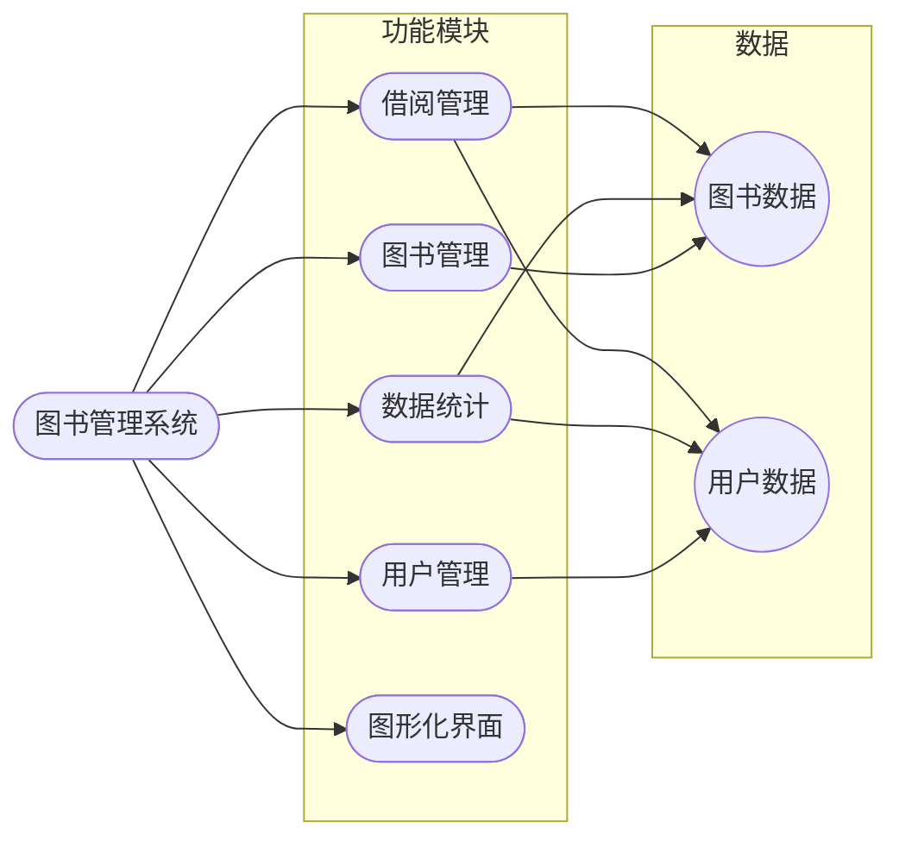
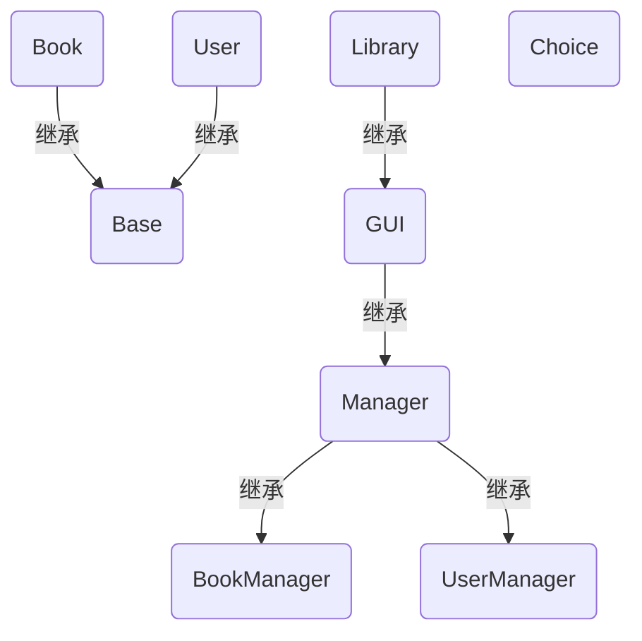
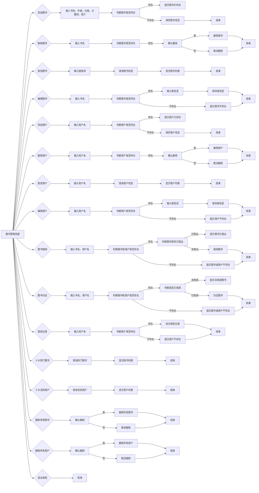
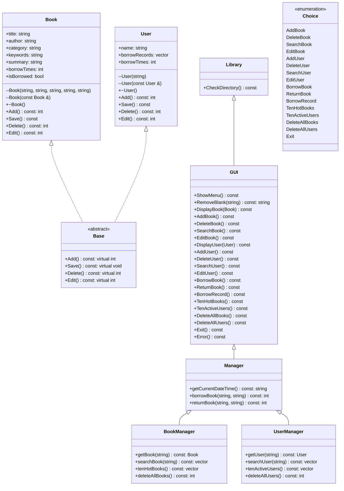

# 图书管理系统

## 系统需求分析

### 目的

- 开发一个功能完善、操作简单、界面友好的图书管理系统，实现图书和用户的增删查改、借阅、归还、记录查询、热门图书和活跃用户统计等功能，提高图书馆的管理效率和服务质量。

### 系统需求

#### 图书管理

- **新建图书**
  - 输入图书信息，包括名称、作者、分类、关键词、简介。
- **修改图书信息**
  - 输入需要修改的图书名称，显示图书信息，输入修改后的信息。
- **删除图书**
  - 输入需要删除的图书名称，确认删除。
- **模糊查询图书**
  - 输入搜索词，显示查询结果。

#### 用户管理

- **新建用户**
  - 输入用户信息，包括用户名。
- **修改用户信息**
  - 输入需要修改的用户名，输入新用户名。
- **删除用户**
  - 输入需要删除的用户名，确认删除。
- **模糊查询用户**
  - 输入搜索词，显示查询结果。

#### 借阅管理

- **图书借阅**
  - 输入图书名称、用户名，确认借阅。
- **图书归还**
  - 输入图书名称、用户名，确认归还。
- **借阅信息查询**
  - 输入用户姓名，显示借阅信息。

#### 数据管理

- **存储图书数据**
  - 每本书用一个 txt 文件存储，包括名称、作者、分类、关键词、简介、借阅状态、借阅次数。
- **存储用户数据**
  - 每个用户用一个 txt 文件存储，包括用户名、借阅记录（借阅图书、借阅时间、归还时间、是否已归还）。
- **查看十大热门图书**
  - 统计图书借阅次数，获取借阅次数最多的十本书。
- **查看十大活跃用户**
  - 统计用户借阅次数，获取借阅次数最多的十个用户。
- **清空数据**

#### 图形化界面

- 提供操作提示和帮助信息，支持中文显示。

#### 输入输出

- **输入验证**
  - 对用户输入进行验证，确保输入合法。包括非空验证、格式验证、范围验证。
- **输出显示**
  - 显示操作结果，包括提示、成功、失败、错误信息。

## 总体设计

图书管理系统包含四个主要功能，分别为图书增删改查、用户增删改查、借阅归还、数据统计。提示用户输入操作编号，根据用户输入调用相应的功能模块，完成相应的操作。

### 系统功能设计及模块图



## 详细设计

### 数据文件

本系统采用文本文件存储图书和用户数据，便于修改和备份。文件名和
数据格式遵循一定的规范，确保数据的准确性和易读性。

#### 文件结构

- **图书数据**

  - 存储在`./data/book/`目录下，文件名与图书名称相同（自动转换为`GBK`编码），扩展名为`.txt`。

- **用户数据**

  - 存储在`./data/user/`目录下，文件名与用户名相同（自动转换为`GBK`编码），扩展名为`.txt`。

#### 数据格式

- **图书数据**

  - 每条数据占用一行。
  - 字段顺序为：标题、作者、分类、关键词、简介、借出状态（1 表示已借出，0 表示未借出）、借出次数。
  - 字段自动转换为`UTF-8`编码。

- **用户数据**

  - 每条数据占用一行。
  - 字段顺序为：书名、借书时间、还书时间、是否已归还（1 表示已归还，0 表示未归还）。
  - 字段自动转换为`UTF-8`编码。

#### 示例

- **图书数据文件**
  文件名：`./data/book/三国演义.txt`

  ```txt
  三国演义
  罗贯中
  历史小说
  三国
  汉末群雄逐鹿中原
  0
  50
  ```

- **用户数据文件**

  文件名：`./data/user/张三.txt`

  ```txt
  三国演义
  2023-04-01 15:18:24
  2023-04-10 15:18:24
  1
  西游记
  2023-04-10 15:28:24
  
  0
  ```

### 类的层次

#### 顶层类 Library

- 这是程序的主类，负责启动程序并调用 GUI 类来展示用户界面和执行操作。

#### GUI

- 继承自 Manager 类，提供了用户界面和用户交互功能。
- 实现了 Manager 类的所有方法，并提供了一些额外的方法来展示菜单、处理用户输入等。

#### Manager

- 继承自 BookManager 和 UserManager 类，整合了图书和用户的管理功能。
- 提供了获取当前日期时间、借书、还书等方法。

#### BookManager

- 负责图书的管理，包括添加、删除、查找、编辑等操作。
- 提供了获取图书、搜索图书、获取热门图书等方法。

#### UserManager

- 负责用户的管理，包括添加、删除、查找、编辑等操作。
- 提供了获取用户、搜索用户、获取活跃用户等方法。

#### Base

- 定义了所有图书和用户类共有的接口，包括添加、保存、删除、编辑等操作。

#### Book

- 继承自 Base 类，定义了图书的信息，包括书名、作者、分类、关键词、简介、借出次数和借出状态。
- 提供了图书的添加、保存、删除、编辑等方法。

#### User

- 继承自 Base 类，定义了用户的信息，包括姓名、借阅记录和借阅次数。
- 提供了用户的添加、保存、删除、编辑等方法。

#### Record

- 定义了借阅记录的信息，包括图书名称、借书时间、还书时间和还书状态。

### 类的关系图



### 界面设计和各功能模块实现

#### 界面设计

该图书管理系统采用简单的命令行界面设计，主要特点如下：

- **菜单显示**
  - 标题：界面顶部显示“图书管理系统”标题，清晰明了。
  - 菜单项：每个菜单项以编号和文字描述的方式呈现，方便用户选择。
  - 分隔线：使用分隔线将菜单项与标题和底部提示信息隔开，使界面更加清晰。
- **提示信息**
  - 操作提示：每个功能模块开始时，都会显示相应的提示信息，说明操作流程。
  - 输入提示：每次需要用户输入信息时，都会显示输入提示，例如：请输入书名、请输入用户名等。
  - 结果提示：每次操作完成后，都会显示结果提示，例如：保存成功、删除失败等。
- **响应方式**
  - 用户通过输入数字选择菜单项，系统根据用户输入执行相应的操作。
  - 用户输入完成后，按回车键确认，系统开始执行操作。
- **优点**
  - 简单易用：界面简洁明了，操作流程清晰，方便用户快速上手。
  - 成本低：无需安装额外的软件，即可运行系统。
  - 跨平台：可在 Windows、Linux 等操作系统上运行。

主要界面如下

- 主菜单

  ```txt
                图书管理系统
  ---------------------------------------
  1. 添加图书            9. 图书借阅
  2. 删除图书            10. 图书归还
  3. 查找图书            11. 借阅记录
  4. 编辑图书            12. 十大热门图书
  5. 添加用户            13. 十大活跃用户
  6. 删除用户            14. 删除所有图书
  7. 查找用户            15. 删除所有用户
  8. 编辑用户            16. 退出
  ---------------------------------------
  
  请选择操作：
  ```

#### 功能模块实现



### UML类图



## 系统调试

### 字符串编码问题

中文版 Windows 系统默认使用`GBK`编码，因此终端和文件系统默认都是`GBK`编码，而 txt 文件中的默认数据是`UTF-8`编码，因此需要在读写文件时进行编码转换。

1. 不同 C++ 编译器可能使用不同编码，为了统一为`UTF-8`编码，需要在文件头部添加`#pragma execution_character_set("utf-8")`，或者在编译选项中添加`-fexec-charset=UTF-8`。
1. 在 Windows 系统下，终端默认使用`GBK`编码，使用chcp 65001命令切换终端编码为`UTF-8`，否则终端无法正确显示中文，在C++程序中使用`system("chcp 65001")`命令切换终端编码。
1. 使用`iconv.h`库进行编码转换，将`UTF-8`编码转换为`GBK`编码，或者将`GBK`编码转换为`UTF-8`编码，确保文件路径和文件内容的正确读写。

### 选项输入验证

用户在输入选项编号时，可能输入非数字字符或者超出范围的数字，因此需要对用户输入进行验证，确保输入合法。

1. getline()函数读取用户输入。
1. 使用`all_of(input.begin(), input.end(), ::isdigit)`函数判断用户输入是否全为数字。
1. 使用`stoi()`函数将字符串转换为整数，判断是否在合法范围内。

### 模糊查询

用户在查找图书或用户时，可能输入部分关键词，需要对输入的搜索词进行模糊查询，找到包含搜索词的所有结果。

1. 使用`find()`函数查找包含搜索词的所有结果。
1. 将结果保存到一个`vector`容器中，便于显示。

### 日期时间处理

在借阅图书和归还图书时，需要记录借书时间和还书时间，因此需要获取当前日期时间。

1. 使用`time.h`库中的`time()`函数获取当前时间戳。
1. 使用`localtime()`函数将时间戳转换为`tm`结构体，获取年月日时分秒。
1. 使用`strftime()`函数将`tm`结构体转换为字符串，格式化日期时间。

### 文件夹不存在问题

在读写文件时，可能会遇到文件夹不存在的问题，因此需要在程序中检查文件夹是否存在，如果不存在则创建文件夹。

1. 使用`filesystem::exists()`函数检查文件夹是否存在。
1. 使用`filesystem::create_directory()`函数创建文件夹。

## 结果分析

### 数据生成

由于本系统是一个图书管理系统，需要大量的图书和用户数据，因此需要生成一定数量的数据，以便测试系统的性能和稳定性。由于使用txt文件存储数据，因此可以手动编写数据文件。测试文件下载地址：[图书管理系统测试数据]()。

### 功能测试

1. 添加图书

    ```txt
    添加图书
    
    请输入书名：梦回大明
    请输入作者：二月河
    请输入分类：历史小说
    请输入关键词：明朝、宫廷、权谋
    请输入简介：本书以明朝为背景，讲述了一段波澜壮阔的宫廷斗争故事。
    
    保存成功
    
    按任意键返回
    ```

    ```txt
    添加图书
    
    
    请输入书名：1984
    图书已存在
    
    按任意键返回
    ```

1. 删除图书（用户）

    ```txt
    删除图书

    请输入书名：梦回大明

    确认删除？(y/n)y

    删除成功

    按任意键返回
    ```

1. 查找图书

    ```txt
    查找图书
    
    
    请输入搜索词（回车显示所有图书）：世界
    
    查询结果
    
    图书1
    书名：平凡的世界
    作者：路遥
    分类：现代文学
    关键词：奋斗、生活、命运
    简介：讲述了主人公孙少平在平凡的世界里，努力拼搏、追求幸福的故事。
    借出状态：未借出
    借出次数：9
    
    图书2
    书名：苏菲的世界
    作者：乔斯坦·贾德
    分类：哲学读物
    关键词：哲学、思考、人生
    简介：以小说的形式，向读者介绍了西方哲学史上的主要流派和思想。
    借出状态：未借出
    借出次数：44
    

    按任意键返回
    ```

1. 编辑图书

    ```txt
    编辑图书
    

    请输入书名：1984
    
    书名：1984
    作者：George Orwell
    分类：Dystopian Fiction
    关键词：Totalitarianism, Surveillance, Reality Control
    简介：A dystopian novel depicting a society under constant surveillance and ruled by a totalitarian regime.
    借出状态：未借出
    借出次数：94
    
    请输入新书名：1948
    请输入新作者：Orwell George
    请输入新分类：Fiction Dystopian
    请输入新关键词：Reality Control
    请输入新简介：A dystopian novel
    
    保存成功
    
    按任意键返回
    ```

1. 添加用户
  
    ```txt
    添加用户
    
    
    请输入用户名：张三
    
    保存成功
    
    按任意键返回
    ```

1. 查找用户

    ```txt
    查找用户

    请输入用户名（回车显示所有用户）：张

    查询结果

    用户1：张三

    用户2：张飞

    按任意键返回
    ```

1. 编辑用户

    ```txt
    编辑用户

    请输入用户名：张三

    请输入新用户名：李四

    保存成功

    按任意键返回
    ```

1. 图书借阅（归还）

    ```txt
    图书借阅

    请输入书名：平凡的世界

    请输入用户名：李四

    图书借阅成功

    按任意键返回
    ```

1. 借阅记录

    ```txt
    借阅记录

    请输入用户名：李四

    借阅次数：6

    借阅记录：

    书名：平凡的世界
    借书时间：2024-07-13 23:57:37
    还书时间：2024-07-13 23:58:15

    书名：百年孤独
    借书时间：2024-07-13 23:59:40
    还书时间：2024-07-14 00:00:35

    书名：哈利·波特
    借书时间：2024-07-13 23:59:56
    还书时间：未还

    书名：红楼梦
    借书时间：2024-07-14 00:00:02
    还书时间：未还

    书名：活着
    借书时间：2024-07-14 00:00:09
    还书时间：未还

    书名：三国演义
    借书时间：2024-07-14 00:00:16
    还书时间：2024-07-14 00:01:03

    按任意键返回
    ```

1. 十大热门图书
  
    ```txt
    十大热门图书
    
    图书1
    书名：三体
    作者：刘慈欣
    分类：科幻小说
    关键词：外星人、文明、战争
    简介：地球文明与三体文明展开了一场跨越光年的宇宙战争，人类命运岌岌可危。
    借出状态：未借出
    借出次数：121
    
    图书2
    书名：1984
    作者：George Orwell
    分类：Dystopian Fiction
    关键词：Totalitarianism, Surveillance, Reality Control
    简介：A dystopian novel depicting a society under constant surveillance and ruled by a totalitarian regime.
    借出状态：未借出
    借出次数：94
    
    图书3
    书名：Pride and Prejudice
    作者：Jane Austen
    分类：Romantic Literature
    关键词：Love, Social Class, Manners
    简介：A witty and humorous tale of manners, marriage, and the pursuit of love in early 19th-century England.
    借出状态：未借出
    借出次数：65
    
    图书4
    书名：小王子
    作者：安托万·德·圣埃克苏佩里
    分类：童话故事
    关键词：成长、哲理、星球
    简介：一部充满哲理的童话故事，讲述了小王子在不同星球上的冒险经历。
    借出状态：未借出
    借出次数：62
    
    图书5
    书名：哈利·波特
    作者：J.K.罗琳 (J.K.Rowling)
    分类：奇幻文学
    关键词：魔法，友谊，勇气
    简介：这一系列小说讲述了一个名叫哈利·波特的孤儿在11岁生日时发现自己是一个巫师，随后被邀请进入霍格沃茨魔法与巫术学校学习 的故事。
    借出状态：已借出
    借出次数：61
    
    图书6
    书名：时间简史
    作者：史蒂芬·霍金
    分类：科普读物
    关键词：宇宙、物理、黑洞
    简介：本书以浅显易懂的语言，介绍了宇宙的起源、发展和结构，让读者领略物理学的魅力。
    借出状态：未借出
    借出次数：56
    
    图书7
    书名：苏菲的世界
    作者：乔斯坦·贾德
    分类：哲学读物
    关键词：哲学、思考、人生
    简介：以小说的形式，向读者介绍了西方哲学史上的主要流派和思想。
    借出状态：未借出
    借出次数：44
    
    图书8
    书名：围城
    作者：钱钟书
    分类：现代文学
    关键词：婚姻、爱情、人生
    简介：以幽默诙谐的笔触，揭示了都市男女在爱情和婚姻中的困惑与挣扎。
    借出状态：未借出
    借出次数：34
    
    图书9
    书名：解忧杂货店
    作者：东野圭吾
    分类：推理小说
    关键词：温情、治愈、推理
    简介：一家神奇的杂货店，为人们解决烦恼，串联起一个个温馨的故事。
    借出状态：未借出
    借出次数：25
    
    图书10
    书名：活着
    作者：余华
    分类：现代文学
    关键词：生存，苦难，人性
    简介：小说以20世纪40年代至70年代中国农村为背景，通过讲述主人公福贵的一生，展现了农民在社会变革中所经历的磨难和折磨。
    借出状态：已借出
    借出次数：14
    
    按任意键返回
    ```

1. 十大活跃用户（示例）

    ```txt
    十大活跃用户

    用户1：李四
    借阅次数：18

    用户2：关羽
    借阅次数：8

    用户3：刘备
    借阅次数：2

    按任意键返回
    ```

1. 删除所有图书（用户）

    ```txt
    确认删除所有图书？(y/n)n

    取消删除

    按任意键返回
    ```

1. 非法输入

## 总结

这次大作业完成的较为满意，完成了所有功能开发、测试，考虑了系统兼容性、乱码等问题，数据便于直接修改。不过也有一些不足，例如 Windows 系统路径对大小写不敏感，这可能导致文件路径的错误。另外，对于一些边界情况和异常情况的处理还可以进一步完善。在未来的版本中，可以考虑添加更多的功能和优化用户体验，比如增加图书推荐功能、用户评分功能等。总体来说，这次大作业是一个很好的学习和实践的机会，让我对图书管理系统的开发有了更深入的了解。我会继续努力学习，提升自己的编程能力。

## 附录：源程序清单

### base.hpp

```cpp
