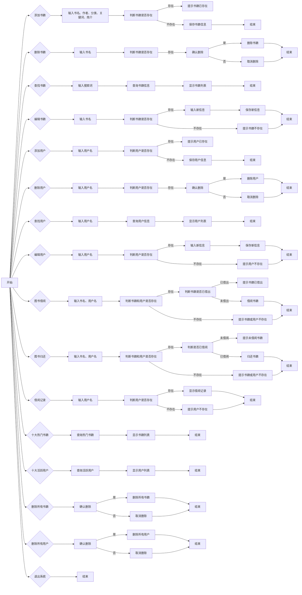

# 图书管理系统

## 系统需求分析

### 目的

- 开发一个功能完善、操作简单、界面友好的图书管理系统，实现图书和用户的增删查改、借阅、归还、记录查询、热门书籍和活跃用户统计等功能，提高图书馆的管理效率和服务质量。

### 系统需求

#### 图书管理

- **新建图书**
  - 输入图书信息，包括名称、作者、分类、关键词、简介。
- **修改图书信息**
  - 输入需要修改的图书名称，显示图书信息，输入修改后的信息。
- **删除图书**
  - 输入需要删除的图书名称，确认删除。
- **模糊查询图书**
  - 输入搜索词，显示查询结果。

#### 用户管理

- **新建用户**
  - 输入用户信息，包括用户名。
- **修改用户信息**
  - 输入需要修改的用户名，输入新用户名。
- **删除用户**
  - 输入需要删除的用户名，确认删除。
- **模糊查询用户**
  - 输入搜索词，显示查询结果。

#### 借阅管理

- **图书借阅**
  - 输入图书名称、用户名，确认借阅。
- **图书归还**
  - 输入图书名称、用户名，确认归还。
- **借阅信息查询**
  - 输入用户姓名，显示借阅信息。

#### 数据管理

- **存储图书数据**
  - 每本书用一个txt文件存储，包括名称、作者、分类、关键词、简介、借阅状态、借阅次数。
- **存储用户数据**
  - 每个用户用一个txt文件存储，包括用户名、借阅记录（借阅图书、借阅时间、归还时间）。
- **查看十大热门书籍**
  - 统计图书借阅次数，获取借阅次数最多的十本书。
- **查看十大活跃用户**
  - 统计用户借阅次数，获取借阅次数最多的十个用户。
- **清空数据**

#### 图形化界面

- 提供操作提示和帮助信息，支持中文显示。

#### 输入输出

- **输入验证**
  - 对用户输入进行验证，确保输入合法。包括非空验证、格式验证、范围验证。
- **输出显示**
  - 显示操作结果，包括成功、失败、错误信息。

## 总体设计

图书管理系统包含四个主要功能，分别为图书增删改查、用户增删改查、借阅归还、数据统计。具体的功能设计及流程如下：

### 系统功能设计及模块图



## 详细设计

### 数据文件

本系统采用文本文件存储图书和用户数据，数据格式遵循一定的规范，确保数据的准确性和易读性。

#### 文件结构

- **图书数据**

  - 存储在`./data/book/`目录下，文件名与图书名称相同（已转换为`GBK`编码），扩展名为`.txt`。

- **用户数据**

  - 存储在`./data/user/`目录下，文件名与用户名相同（已转换为`GBK`编码），扩展名为`.txt`。

#### 数据格式

- **图书数据**

  - 每条数据占用一行。
  - 字段顺序为：标题、作者、分类、关键词、简介、借出状态（1 表示已借出，0 表示未借出）、借出次数。
  - 字段为`UTF-8`编码。

- **用户数据**

  - 每条数据占用一行。
  - 字段顺序为：书名、借书时间、还书时间、是否已归还（1 表示已归还，0 表示未归还）。
  - 字段为`UTF-8`编码。

#### 示例

- **图书数据文件**
  文件名：`./data/book/三国演义.txt`

  ```txt
  三国演义
  罗贯中
  历史小说
  三国
  汉末群雄逐鹿中原
  0
  50
  ```

- **用户数据文件**

  文件名：`./data/user/张三.txt`

  ```txt
  三国演义
  2023-04-01 15:18:24
  2023-04-10 15:18:24
  1
  西游记
  2023-04-10 15:28:24
  
  0
  ```

### 类的层次图


### 类图


